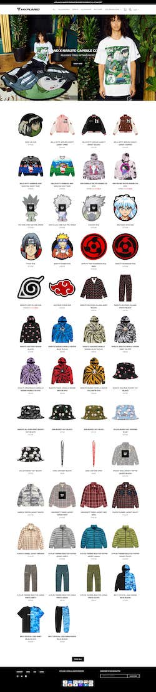
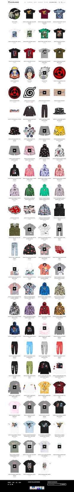
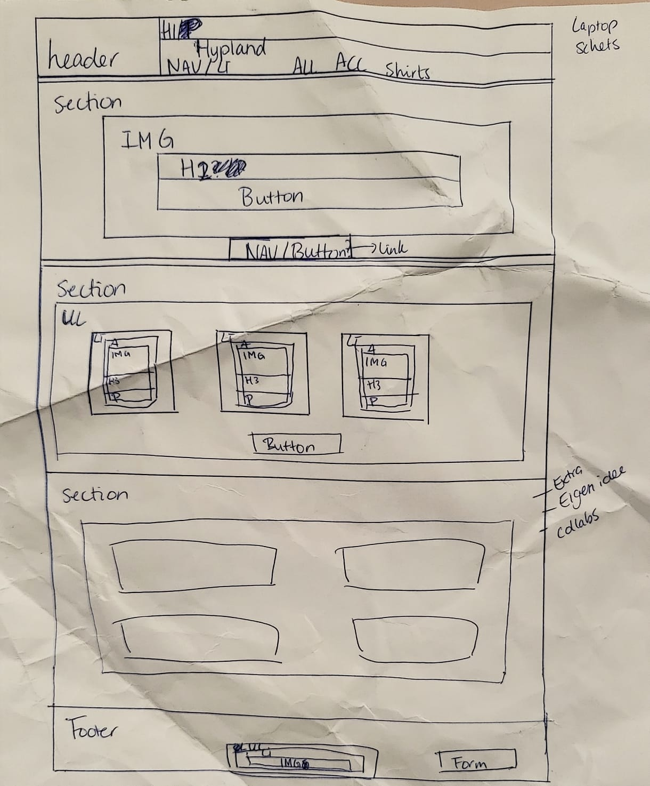
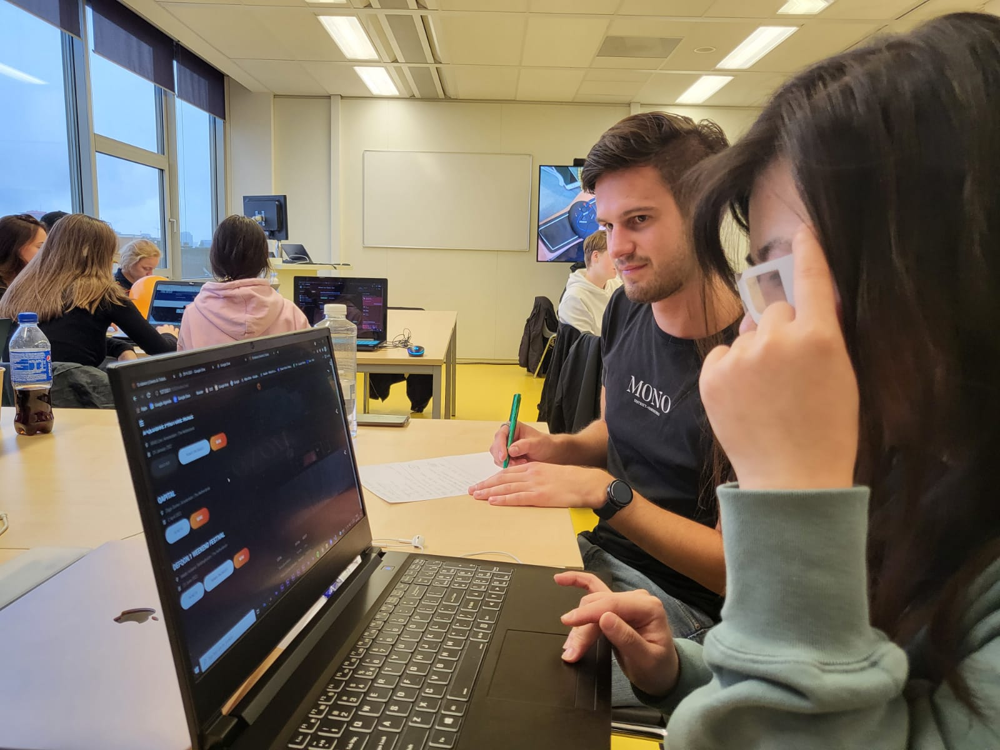
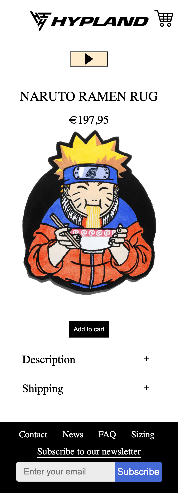

# Procesverslag
Markdown is een simpele manier om HTML te schrijven.  
Markdown cheat cheet: [Hulp bij het schrijven van Markdown](https://github.com/adam-p/markdown-here/wiki/Markdown-Cheatsheet).

Nb. De standaardstructuur en de spartaanse opmaak van de README.md zijn helemaal prima. Het gaat om de inhoud van je procesverslag. Besteedt de tijd voor pracht en praal aan je website.

Nb. Door *open* toe te voegen aan een *details* element kun je deze standaard open zetten. Fijn om dat steeds voor de relevante stuk(ken) te doen.

## Jij

uitwerken voor kick-off werkgroep

### Auteur:
Sally Mok

#### Je startniveau:
Rode piste

#### Je focus:
hier je focus (kies uit responsive óf surface plane)
 

## Je website

uitwerken voor kick-off werkgroep

### Je opdracht:
https://hypland.com

Anime kleding webshop

#### Screenshot(s) van de eerste pagina (small screen): 
Homepagina

#### Screenshot(s) van de tweede pagina (small screen):
Hypeland x collab

 

## Breakdownschets (week 1)

uitwerken na afloop 2e werkgroep

### de hele pagina: 

Ik vond het best moeilijk om een breakdownschets te maken, omdat ik nog niet weet wat ik precies wil maken.

### dynamisch deel (bijv menu): 

### wellicht nog een dynamisch deel (bijv filter): 

## Voortgang 1 (week 2)

uitwerken voor 1e voortgang

### Stand van zaken
hier dit ging goed & dit was lastig (neem ook screenshots op van delen van je website en code)

Ik heb te weinig code en werk om te laten zien, hierdoor kreeg ik geen feedback. Ik ben nog bezig met
de html.

### Agenda voor meeting
samen met je groepje opstellen

Mijn groepje en ik hebben geen agenda opgesteld, we stelden individueel vragen.

### Verslag van meeting
hier na afloop snel de uitkomsten van de meeting vastleggen

Geen uitkomsten, ik moet nog veel aan mijn website werken.

## Voortgang 2 (week 3)

uitwerken voor 2e voortgang

### Stand van zaken
hier dit ging goed & dit was lastig (neem ook screenshots op van delen van je website en code)

Ik heb te weinig code en werk om te laten zien, hierdoor kreeg ik geen feedback.

### Agenda voor meeting
samen met je groepje opstellen

Mijn groepje en ik hebben geen agenda opgesteld, we stelden individueel vragen.

### Verslag van meeting
hier na afloop snel de uitkomsten van de meeting vastleggen

Geen uitkomsten, ik moet nog veel aan mijn website werken.

## Toegankelijkheidstest (week 4)

uitwerken na test in 8e voortgang

### Bevindingen
Als ik een website voor een persoon met een (motorische) beperking zou maken, dan zou die niet goed
gekeurd worden. 

#### Titel eerste bevinding
Hier korte omschrijving (met indien nodig een afbeelding)
Tijdens de les kregen we verschillende brillen om de ogen deels de bedekken of een ander kleur te geven aan het beeld.

Qua kleurencontract is mijn website niet goed voor iemand die slechtziend is. Ik zou de kleuren moet aanpassen, zodat er meer een duidelijk contract te zien is tussen de verschillende kleuren. Ook zou ik mijn buttons groter moet maken, zo kunnen mensen die slecht zien het beter kunnen aanklikken dan wanneer het erg klein is. 

#### Titel tweede bevinding. 
Hier korte omschrijving (met indien nodig een afbeelding)
Voor de tweede test kreeg ik een 'trilapparaat' vastgeplakt aan mijn arm, dit moest de trillende handen van een Parkinson patient nabootsen. 

Mijn bevinding was dat het typen erg moeizaam ging en het aanklinken van links en buttons ook.
Het typen kan ik niet verbeteren, omdat dit met de keyboard gaat. Wat ik wel kan verbeteren hiier, zijn de links en buttons groter maken. 

## Voortgang 3 (week 4)

uitwerken voor 3e voortgang

### Stand van zaken
hier dit ging goed & dit was lastig (neem ook screenshots op van delen van je website en code)

Tijdens het voortgang gesprek was ik qua vormgeving klaar met mijn homepagina en moest ik nog beginnen met mijn 2e pagina. Hier wist ik nog niet welk pagina ik wilde maken. Mijn focus lag op surface plane en ik dacht als ik een collab pagina zou maken, verandert er niet veel qua vormgeving. Ik heb daarom gekozen om een product pagina te maken.

Verder had ik geen vragen aan de studentassistenten, behalve of er een 2e style.css gemaakt mag worden voor de 2e webpagina en ik kreeg als antwoord nee. 

### Agenda voor meeting
samen met je groepje opstellen

Mijn groepje en ik hebben geen agenda opgesteld, we stelden individueel vragen.

### Verslag van meeting
hier na afloop snel de uitkomsten van de meeting vastleggen

Volgens de studenassistente zien mijn homepagina er goed uit en ik moet nu nog aan de slag met pagina 2 en 
de surface plan aan toevoegen.

## Eindgesprek (week 5)

uitwerken voor eindgesprek

### Stand van zaken
hier dit ging goed & dit was lastig (neem ook screenshots op van delen van je website en code)

Over het algemeen vond ik het goed gaan. Ik was alleen erg laat begonnen aan het project, waardoor ik in  de laatste week gehaast alles moest afmaken. Als er dingen waren die ik niet wist hoe het gedaan moest worden, ging ik op https://www.w3schools.com/ kijken of ik daar de info kon vinden die ik nodig had. Zoals de hamburger menu en slider voor mijn afbeeldingen heb ik op Youtube tutorials bekeken, omdat ik er niet uitkwam. 

Waar ik heel lang mee vastzat, was de javascript. Ik heb op 2 pagina's functies aangemaakt op 1 script, alleen stonden niet alle funties op beide pagina's. Hierdoor kreeg ik steeds een foutmelding op mijn console en sommige functies konden niet meer uitgevoerd worden. Doordat ik te laat aan mijn website was begonnen, had ik de studentassistenten niet meer gecontacteerd voor hulp. Wat ik had gedaan om het probleem op te lossen, was een extra javascript maken en deze aan mijn homepagina html koppelen. Zo werken alle functies weer, alleen weet ik niet of er 2 javascripten gebruikt mogen worden. Want voor css mag er maar 1 bestand gebruikt worden voor beide pagina's.

### Screenshot(s)

hier screenshot(s) van je eindresultaat

Homepagina

Product pagina

## Bronnenlijst

continu bijhouden terwijl je werkt

Nb. Wees specifiek ('css-tricks' als bron is bijv. niet specifiek genoeg).

1. Audio: https://www.youtube.com/watch?v=jqXUm2YS-mM
2. Hamburger menu tutorial: https://www.youtube.com/watch?v=BN6fH1nRDxA
3. Afbeeldingen slider tutorial: https://www.youtube.com/watch?v=SYw3TTLtZLc
4. Afbeeldingen: https://hypland.com/
5. Play svg: https://www.svgrepo.com/svg/156337/play-button
5. Pauze svg: https://www.iconfinder.com/icons/211871/pause_icon
6. Zon/maan svg: https://icon-icons.com/icon/theme-light-dark/137104
7. Winkelkar: https://www.svgrepo.com/svg/48190/shopping-cart

